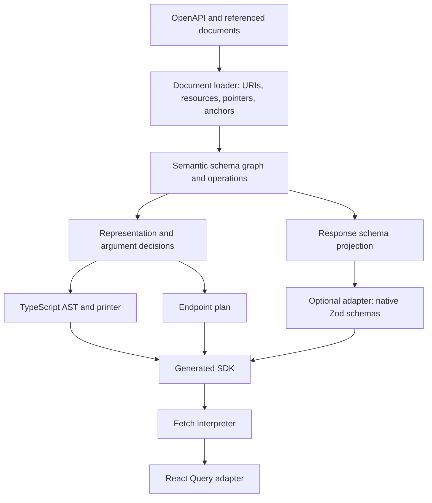

# Architecture

Accord owns schema interpretation and type generation. It reads OpenAPI once into an indexed schema graph, derives each operation's calling convention and transport representation, and produces TypeScript types plus a declarative runtime plan. Optional validators derive from the same graph and response projection.



## The model

`SchemaNode` has an identity, source location, intact schema rules, edges to schema-valued children, and an optional resolved reference. Rules preserve keyword scope: an `allOf` remains an `allOf`; it is not flattened into a different validation schema. Example/default values are data and are not reference instructions.

`SchemaResource` defines a URI scope and its static/dynamic anchors. A nested `$id` starts a resource; a resource need not be a whole file. Loading follows reachable references before type generation and keeps source locations for diagnostics.

`OperationModel` ties parameters, request/response schemas, codec decisions, public names, and the runtime plan together. Schema uses carry a codec directly: JSON, text, bytes, a form, or XML. There is no separate representation wrapper or synthetic representation ID. Parameter and form styles live in those transport decisions. The client never ships the source graph.

The type emitter reads the schema graph and representation decision directly into TypeScript's AST. There is no separate general-purpose type-expression graph and no openapi-typescript dependency. Named references are handled by an identity/name registry, including recursive types and separate request/response aliases.

## Generated endpoints

The output combines ordinary exported TypeScript types with `defineEndpoint<Contract, "query" | "mutation">({ method, path, ... })`. The contract has the argument tuple, input, successful result, error payload, per-status payloads, and full-response union. It exists only in TypeScript: the object has no `contract` or `plan` wrapper; `kind` is `query` or `mutation`, and `id` is the operation ID. `defineEndpoint` adds an internal symbol so the client can distinguish an endpoint from a namespace. Validation lives in optional response `schema` entries. `createEndpointFactory(scope)` attaches one stable SDK identity through a symbol without repeating a public `apiId` field. A batch allocator gives schemas short names, qualifying every participant in a conflict.

The plan describes how to bind inputs, serialize request representations, select status/media, decode responses, and choose payload versus status-envelope results. Status selectors stay compact (`200`, `2XX`, `default`); runtime and type generation share exact/range/default precedence.

Responses form one record keyed by status:

```ts
responses: {
  200: { mediaType: "application/json", schema: GetUser200Schema },
  204: {},
  "4XX": { mediaType: "application/json", schema: ClientErrorSchema },
  default: { mediaType: "application/json", schema: ErrorSchema },
}
```

A status with multiple media types uses an array only for that value: `200: [{ mediaType: "application/json", schema: UserSchema }, { mediaType: "text/csv" }]`. A bodyless response uses `{}`. Schema entries appear only when validation is generated. Status and media selection also select validation, with no parallel registry or ordinal keys. `codec` is omitted when the shared `defaultCodec(mediaType, direction)` determines JSON, ordinary text, or bytes. Schema-dependent cases such as numeric text, XML names and form field encodings retain an explicit codec. Inference uses the declared media type, including wildcard declarations, so it agrees with generated types.

Request parameters are grouped into `pathParams`, `queryParams`, `headerParams`, and `cookieParams`, each with location-specific options. The usual entry is just `{ name: "id" }`; `inputName` is emitted only for a rename. Requiredness stays in the semantic model and public TypeScript input, not in the runtime binding. Defaults follow the [OpenAPI parameter rules](https://spec.openapis.org/oas/v3.1.1.html#parameter-object): simple path/header encoding, form query/cookie encoding, exploded form values, and reserved-character escaping. Only overrides are emitted. Empty parameter groups are omitted.

Request bodies are flat discriminated unions on `type`: `json`, `text`, `binary`, `multipart`, `urlencoded`, or `xml`. A normal upload is:

```ts
requestBody: {
  type: "multipart",
  required: true,
  fields: {
    category: {},
    file: { type: "binary" },
    note: {},
  },
}
```

The field map both extracts the body from flat caller inputs and describes how to encode each part. There is no repeated list of field names, `content` array, or `codec` wrapper. An empty field definition means text/plain. JSON parts use `{ type: "json" }`; repeated parts add `multiple: true`. Non-default part media types, headers and style/explode/allowReserved options remain explicit. Dynamic field encodings live in `additional` and `patterns`; empty maps and default binary passthrough are omitted.

JSON uses `requestBody: { type: "json", required: true, fields: ["title", "status"] }`. The media type follows `type` by default; a custom media type such as `text/csv` or `application/merge-patch+json` is retained as `mediaType`. XML retains its root and node metadata. `mode: "separate"` uses the caller's `body` value directly; otherwise fields come from the flat first argument. Requiredness controls whether an empty flattened body is sent, without validating caller input.

Multiple accepted formats use an array of flat definitions, with the default first:

```ts
requestBody: [
  { type: "json", required: true, mode: "separate" },
  { type: "text", mediaType: "text/csv", required: true, mode: "separate" },
]
```

The generator puts JSON first when declared, or honors `defaultMediaTypes`. The call's second-argument `headers["content-type"]` selects another format and remains correlated with its input type. Shared media defaults and a small transport-default expansion feed the existing codecs; request schemas and caller values are never reinterpreted by that expansion.

Payload-only results are the default; status-envelope results retain their flag. Response header declarations remain in the semantic model; the runtime exposes the actual Fetch `Headers` without carrying unused declarations.

### Routing and credentials

`createClient(api, { baseUrl })` controls routing. Generated endpoints do not contain OpenAPI `servers`, and there are no `server` or `serverVariables` client options. A regional or operation-specific origin belongs in a separate client or request middleware. Without `baseUrl`, the client uses the browser origin, or `http://localhost` outside a browser.

Authentication is a runtime extension point. `token` accepts a static string or callback; `auth` accepts an `AuthProvider` or an ordered array of providers. Providers receive mutable headers/URL, Fetch init, endpoint metadata, and the base URL. Configured auth applies to every call unless its second argument sets `auth: false`. Generated endpoints contain no security metadata. API-key placement is explicit provider configuration; provider `sensitiveFields` declarations guide cache-key redaction. Per-call headers override provider headers.

Built-ins cover Bearer, Basic, API keys, custom callbacks, and OAuth client credentials. The client-credentials provider requires an explicit token URL and accepts optional scopes, caches by token URL and scope set, and shares in-flight acquisitions. Authorization-code/PKCE/device flows remain application concerns behind callbacks. React Query uses opaque auth context identity and a public `cacheScope`. See [authentication](authentication.md) for the complete contract.

The runtime reconstructs flattened closed bodies using the model's fields and preserves nested bodies whole. It delegates serialization to shared codecs and does not reparse caller inputs. Generated validators execute only on responses. Full results and errors retain Fetch response metadata.

## Validation and library interoperability

Validation is disabled by default. Core projects decoded response schemas from the same semantic graph used for types and metadata, then delegates to an explicit `ValidationAdapter`. Its stable interface receives normalized JSON Schema documents, export names/types, reference types, and a batch name allocator; it returns TypeScript imports and declarations.

`@accord/zod` generates native Zod schemas. Simple objects expose `.shape` directly; arrays, unions, references and constraints become ordinary constructors or refinements. Shared models have named definitions and recursion uses `z.lazy`. The schemas already implement Standard Schema v1, so the client needs no library-specific validation integration. There are no numbered checks, registry factories, or validator sidecar files.

The adapter fails generation on features it cannot represent faithfully, including dynamic references and branch-dependent unevaluated properties. See [its exact support boundary](../packages/zod/README.md). A small optional refinement module supports complex constraints without interpreting schema documents. The client preserves the original decoded value after validation; consumers calling native `.parse()` get normal Zod semantics, including copying.

## Package boundaries

- `@accord/codegen`: document loading, semantic compilation, TypeScript AST emission, adapter-driven schema emission, CLI and atomic output writes.
- `@accord/client`: endpoint contract types, shared Fetch execution, serialization/decoding, errors, pluggable auth, and library-independent Standard Schema consumption.
- `@accord/zod`: optional native Zod emitter and shared refinement helpers.
- `@accord/react-query`: option factories/hooks and cache identity. It consumes endpoints rather than reinterpreting OpenAPI.

The concrete implementation starts in `packages/codegen/src/{loader,model,compile,schema,request-plan,type-emitter,render-sdk,validators}.ts`, `packages/client/src/{types,client,request-body,codecs}.ts`, and `packages/react-query/src/index.ts`.
