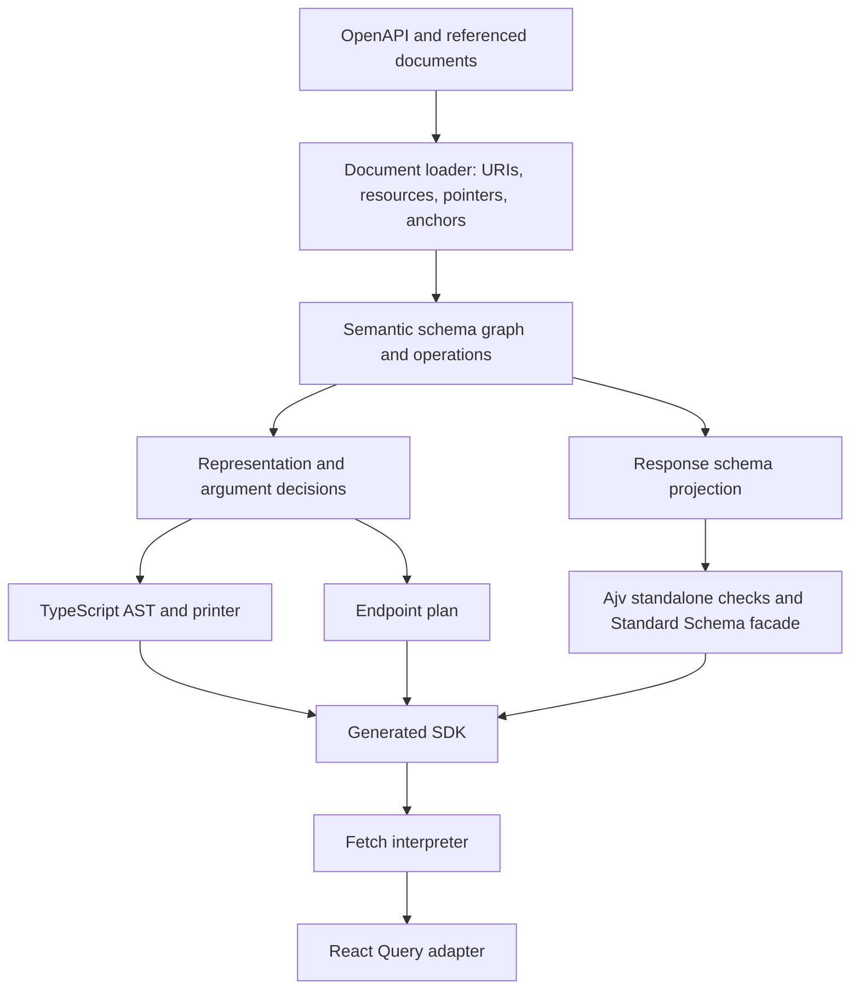

# Architecture

Accord owns schema interpretation and type generation. It reads OpenAPI once into an indexed schema graph, derives each operation's calling convention and transport representation, and produces TypeScript types plus a declarative runtime plan. Optional validators derive from the same graph and response projection.



## The model

`SchemaNode` has an identity, source location, intact schema rules, edges to schema-valued children, and an optional resolved reference. Rules preserve keyword scope: an `allOf` remains an `allOf`; it is not flattened into a different validation schema. Example/default values are data and are not reference instructions.

`SchemaResource` defines a URI scope and its static/dynamic anchors. A nested `$id` starts a resource; a resource need not be a whole file. Loading follows reachable references before type generation and keeps source locations for diagnostics.

`OperationModel` ties parameters, request/response schemas, codec decisions, public names, and the runtime plan together. Schema uses carry a codec directly: JSON, text, bytes, a form, or XML. There is no separate representation wrapper or synthetic representation ID. Parameter and form styles live in those transport decisions. The client never ships the source graph.

The type emitter reads the schema graph and representation decision directly into TypeScript's AST. There is no separate general-purpose type-expression graph and no openapi-typescript dependency. Named references are handled by an identity/name registry, including recursive types and separate request/response aliases.

## Generated endpoints

The output combines ordinary exported TypeScript types with `defineEndpoint<Contract, "query" | "mutation">({ method, path, ... })`. The contract has the argument tuple, input, successful result, error payload, per-status payloads, and full-response union. It exists only in TypeScript: the object has no `contract`, `kind`, or `plan` field. `defineEndpoint` adds an internal symbol so the client can distinguish an endpoint from a namespace. Validation is separate and lives in the optional response `schema` entries.

The plan describes how to bind inputs, serialize request representations, select status/media, decode responses, and choose payload versus status-envelope results. Status selectors stay compact (`200`, `2XX`, `default`); runtime and type generation share exact/range/default precedence.

Each response media entry optionally references its Standard Schema directly: `{ mediaType: "application/json", schema: UserSchema }`. Status and media selection also select validation, with no parallel registry or ordinal keys. `codec` is omitted when the shared `defaultCodec(mediaType, direction)` determines JSON, ordinary text, or bytes. Schema-dependent cases such as numeric text, XML names and form field encodings retain an explicit codec. Inference uses the declared media type, including wildcard declarations, so it agrees with generated types.

Request parameters are grouped into `pathParams`, `queryParams`, `headerParams`, and `cookieParams`, each with location-specific options. The usual entry is just `{ name: "id" }`; `inputName` is emitted only for a rename. Requiredness stays in the semantic model and public TypeScript input, not in the runtime binding. Defaults follow the [OpenAPI parameter rules](https://spec.openapis.org/oas/v3.1.1.html#parameter-object): simple path/header encoding, form query/cookie encoding, exploded form values, and reserved-character escaping. Only overrides are emitted. Empty parameter groups are omitted.

Request bodies default to `mode: "merge"`, optional requiredness, and JSON when declared (otherwise the first declared media type). Payload-only results are the default. Explicit body mode, required bodies, alternate default media, and status-envelope results retain their flags. Response header declarations remain in the semantic model; the runtime exposes the actual Fetch `Headers` without carrying unused declarations.

### Routing and credentials

`createClient(api, { baseUrl })` controls routing. Generated endpoints do not contain OpenAPI `servers`, and there are no `server` or `serverVariables` client options. A regional or operation-specific origin belongs in a separate client or request middleware. Without `baseUrl`, the client uses the browser origin, or `http://localhost` outside a browser.

Authentication currently means placing caller-provided credentials on a request:

```ts
const client = createClient(api, {
  baseUrl: "https://api.example.com",
  credentials: { bearer: accessToken },
})
```

An endpoint's `security` lists alternatives: entries are OR, schemes within an entry are AND. `securitySchemes` tells the executor where to put each named credential (Bearer/Basic authorization, API-key header/query/cookie). Scheme dictionaries are shared constants in the generated module; the dictionary also identifies sensitive headers/query parameters for cache-key redaction, even on public operations. Public endpoints omit `security`; APIs without security schemes omit both fields. An explicit empty security alternative permits an anonymous call. The executor uses the first alternative whose credentials were supplied, and leaves authentication to caller headers/server policy if none match.

There is no login, refresh, OAuth redirect, or scope enforcement. OAuth/OpenID entries accept an already-acquired bearer token; mutual TLS requires a configured Fetch transport. Callers can instead provide global headers, a header resolver for fresh tokens, or per-call headers. Per-call headers override automatically applied credentials. React Query excludes recognized credential values from keys and isolates client contexts.

The runtime reconstructs flattened closed bodies using the model's fields and preserves nested bodies whole. It delegates serialization to shared codecs and does not reparse caller inputs. Generated validators execute only on responses. Full results and errors retain Fetch response metadata.

## Validation and library interoperability

The optional validator backend projects response read/write rules and references into real JSON Schema trees and compiles them with Ajv at generation time. Referenced models share checks. Bundled JavaScript checks and helpers are embedded in a private factory at the end of the generated TypeScript file. A mechanical AST pass annotates their dynamic JavaScript internals; a `ValidationFunction` boundary keeps that implementation separate from the public types without disabling TypeScript checking. Schema files are not interpreted at runtime, and there is no `eval` or runtime compilation. The generated facade implements [Standard Schema](https://standardschema.dev/), so compatible consumers can accept it directly.

`createAccordValidators()` runs once during SDK module initialization and returns the private compiled check functions. Names such as `check0` have no API meaning. Exported `standardSchema<T>(check)` facades add the inferred type and translate validation errors to Standard Schema issues. Endpoints reference those exported schemas directly; consumers can also import them to validate data outside HTTP. There is no additional `responseSchemas` object.

Standard Schema is a validation interface, not a portable description from which a native Zod/ArkType object tree can be reconstructed. A downstream wrapper delegates validation; it does not gain the target library's object-shape introspection. Native library-specific emitters remain a later backend option.

## Package boundaries

- `@accord/codegen`: document loading, semantic compilation, TypeScript AST emission, optional validator compilation, CLI and atomic output writes.
- `@accord/client`: endpoint contract types, shared Fetch execution, serialization/decoding, errors, optional Standard Schema facade.
- `@accord/react-query`: option factories/hooks and cache identity. It consumes endpoints rather than reinterpreting OpenAPI.

The concrete implementation starts in `packages/codegen/src/{loader,model,compile,schema,type-emitter,render-sdk,validators}.ts`, `packages/client/src/{types,client,codecs}.ts`, and `packages/react-query/src/index.ts`.
